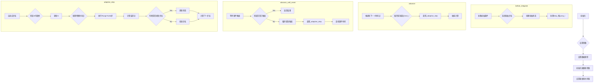

```mermaid
flowchart TD
    A[初始化] --> B{设置参数}
    B --> C[设置数据类型]
    C --> D[初始化函数和参数]
    D --> E[设置表格和中间值]

    subgraph before_integrate
    F[准备初始条件] --> G{选择初始步长}
    G --> H[创建初始状态]
    H --> I[处理step_t和jump_t]
    end

    subgraph advance
    J[推进到下一个时间点] --> K{循环直到超过next_t}
    K --> L[调用_adaptive_step]
    L --> M[插值计算]
    end

    subgraph advance_until_event
    N[等待事件触发] --> O{检查是否已触发}
    O -->|Yes| P[返回结果]
    O -->|No| Q[循环直到触发]
    Q --> R[调用_adaptive_step]
    R --> S[查找事件时间]
    end

    subgraph adaptive_step
    T[自适应步长] --> U{检查dt有效性}
    U --> V[更新t1]
    V --> W{处理特殊时间点}
    W --> X[执行Runge-Kutta步]
    X --> Y[计算误差比]
    Y --> Z{判断是否接受步长}
    Z -->|Yes| AA[更新状态]
    Z -->|No| AB[拒绝步长]
    AA --> AC[计算下一步长]
    AB --> AC
    end
```