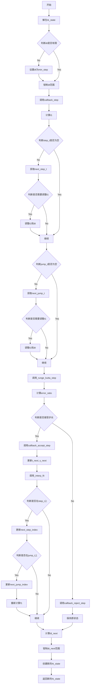

```mermaid
flowchart TD
    A[开始] --> B[解包rk_state]
    B --> C{判断dt是否有限}
    C -->|No| D[设置dt为min_step]
    D --> E[钳制dt范围]
    C -->|Yes| E
    
    E --> F[调用callback_step]
    F --> G[计算t1]
    
    G --> H{判断step_t是否为空}
    H -->|No| I[获取next_step_t]
    I --> J{判断是否需要调整t1}
    J -->|Yes| K[调整t1和dt]
    K --> L[继续]
    J -->|No| L
    H -->|Yes| L
    
    L --> M{判断jump_t是否为空}
    M -->|No| N[获取next_jump_t]
    N --> O{判断是否需要调整t1}
    O -->|Yes| P[调整t1和dt]
    P --> Q[继续]
    O -->|No| Q
    M -->|Yes| Q
    
    Q --> R[调用_runge_kutta_step]
    R --> S[计算error_ratio]
    S --> T{判断是否接受步长}
    T -->|Yes| U[调用callback_accept_step]
    U --> V[更新t_next, y_next]
    V --> W[调用_interp_fit]
    W --> X{判断是否在step_t上}
    X -->|Yes| Y[更新next_step_index]
    Y --> Z{判断是否在jump_t上}
    Z -->|Yes| AA[更新next_jump_index]
    AA --> AB[重新计算f1]
    AB --> AC[继续]
    Z -->|No| AC
    X -->|No| AC
    
    AC --> AD[计算dt_next]
    AD --> AE[钳制dt_next范围]
    AE --> AF[创建新的rk_state]
    AF --> AG[返回新的rk_state]
    
    T -->|No| AH[调用callback_reject_step]
    AH --> AI[保持原状态]
    AI --> AD
```