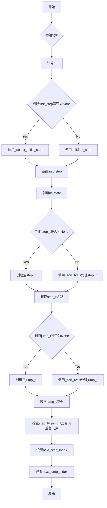

```mermaid
flowchart TD
    A[开始] --> B{初始化t0}
    B --> C[计算f0]
    C --> D{判断first_step是否为None}
    D -->|Yes| E[调用_select_initial_step]
    D -->|No| F[使用self.first_step]
    E --> G[设置first_step]
    F --> G
    G --> H[创建rk_state]
    
    H --> I{判断step_t是否为None}
    I -->|Yes| J[创建空step_t]
    I -->|No| K[调用_sort_tvals处理step_t]
    J --> L[转换step_t类型]
    K --> L
    
    L --> M{判断jump_t是否为None}
    M -->|Yes| N[创建空jump_t]
    M -->|No| O[调用_sort_tvals处理jump_t]
    N --> P[转换jump_t类型]
    O --> P
    
    P --> Q[检查step_t和jump_t是否有重复元素]
    Q --> R[设置next_step_index]
    R --> S[设置next_jump_index]
    S --> T[结束]
```